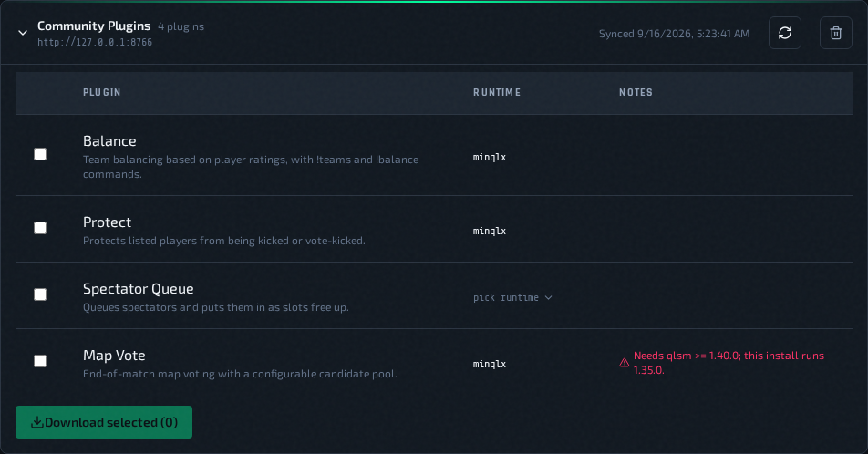
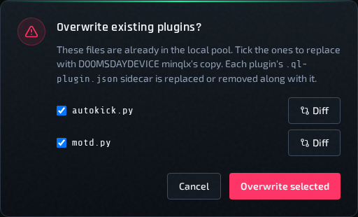
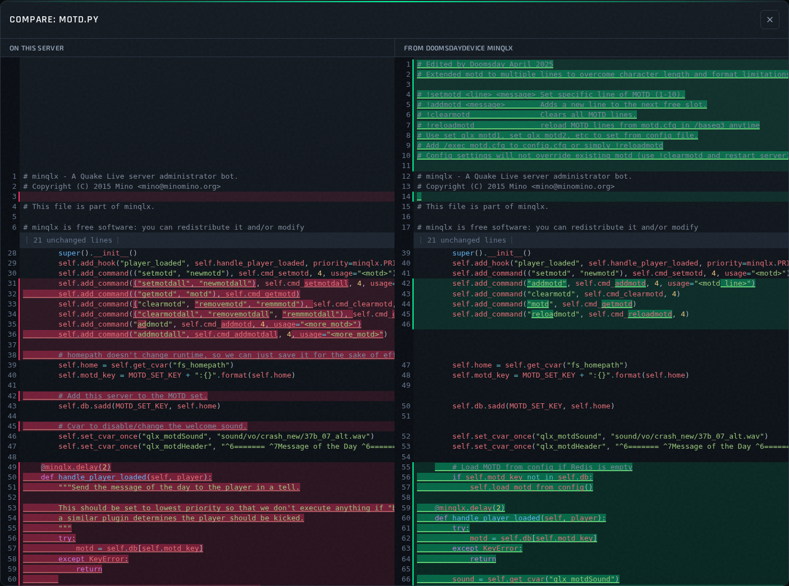

# Plugin Repositories

**Settings → Plugin Repositories** lets you add third-party plugin sources and download their plugins into QLSM's shared plugin folder.

## Add A Repository

1. Click **Add Repository** and enter a name and the repository's URL.
2. QLSM fetches `<URL>/qlsm-plugins.json` right away and lists the plugins it describes.

**GitHub links work directly.** Paste the repository page URL, for example `https://github.com/D00MSDAYDEVICE/minqlx`, and QLSM converts it to the raw file address itself, looking on the `main` branch and then `master`. The card keeps showing the address you typed. To use another branch or a subfolder, paste that page's URL, such as `https://github.com/owner/repo/tree/dev/plugins`. Private repositories aren't supported.

Any other file host works too, as long as the files are served directly. The URL is treated as a folder that holds `qlsm-plugins.json` and the plugins.

Names must be unique (ignoring case), and a URL can only be added once (ignoring a trailing `/`). Click the sync icon on a repository to fetch its list again.

A repository's `qlsm-plugins.json` looks like this. Every field except `filename` is optional:

```json
{
  "plugins": [
    {
      "filename": "hello_qlsm.py",
      "label": "Hello QLSM",
      "description": "Replies to !hello.",
      "runtime": "minqlxtended",
      "requires_qlsm_version": "1.36.0",
      "cvars": [
        { "cvar": "qlx_helloMessage", "label": "Reply text", "type": "string", "default": "Hello!", "description": "What !hello replies with." }
      ]
    },
    { "filename": "another_plugin.py" }
  ]
}
```

One file describes every plugin in the repository. `cvars` (and `commands`) use the same format as a `.ql-plugin.json` file. When you download a plugin, QLSM saves its label, description, cvars and commands next to it, which gives it an editable settings form (see [Plugin Settings](edit-configs.md#plugin-settings-cvars)).

A plugin can still ship its own `<name>.ql-plugin.json` file next to its `.py` file. If it does, QLSM uses that file instead of the plugin's entry in `qlsm-plugins.json`.

Inline `cvars`/`commands` need QLSM 1.36.0 or newer. Older versions ignore them.

## Download Plugins



1. Expand a repository and tick the plugins you want.
2. A plugin that doesn't declare its runtime needs one picked in its row before **Download selected** is enabled.
3. Click **Download selected**.

- Each plugin goes into the shared plugin folder for its runtime: `data/shared-plugins/minqlx/` or `data/shared-plugins/minqlxtended/` under your QLSM install. That folder is kept outside the QLSM image, so downloads survive updates and are visible to every part of QLSM. The plugins QLSM ships with stay untouched; a download with the same name as a built-in plugin replaces it on every host once you confirm the overwrite prompt.
- If a file with the same name is already there and its code differs, QLSM asks before overwriting it (a copy that only differs in line endings is left as is). Each file in that prompt has a checkbox and a **Diff** button. Untick any file you want to keep, and click **Diff** to compare this server's copy (left) with the repository's copy (right) first. Removed lines are red, added lines green, and unchanged sections are folded. Overwriting a plugin also replaces its `.ql-plugin.json` sidecar with the repository's, or removes it when the repository has none; the diff only compares the `.py` file.





- A plugin that needs a newer QLSM version than you're running shows a red warning. You can still download it.

## Use A Downloaded Plugin

Downloading a plugin also pushes QLSM's shared plugin folder to every **Active** host that runs the plugin's runtime. The success message names the hosts. A host that is busy with another job, or not Active, is listed as skipped; run [Check for Updates](check-for-updates.md) on it later, or use the push button described below.

1. Open the instance's config (or **Deploy A New Instance**) and go to the **Plugins** tab. The plugin is listed with the other shared plugins (see [Shared Plugins](edit-configs.md#shared-plugins)), marked **shared** once the host has it.
2. If the row shows **not on host** instead, the host has not received the file yet. Click the upload icon next to it to push the shared folder to that host, and wait for the badge to clear.
3. Tick the plugin and save. Restart the instance to load it.
